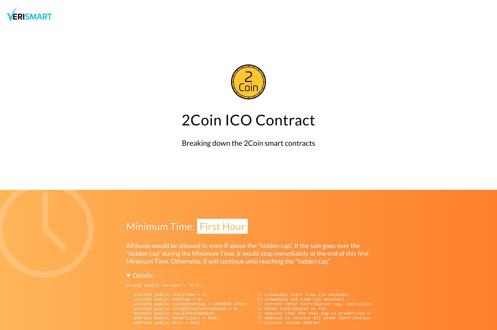
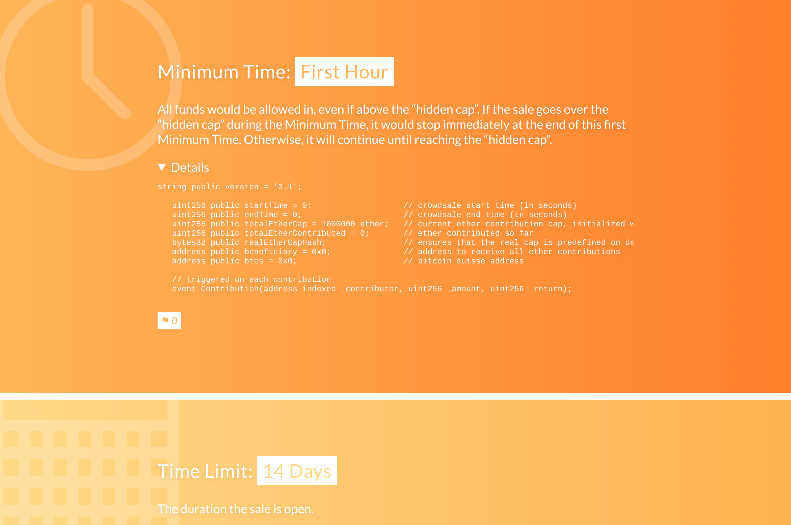
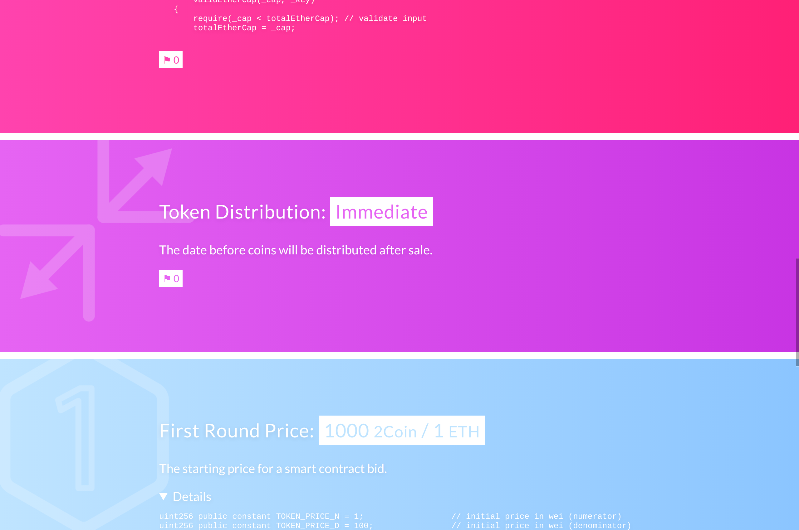

# VeriSmart

A speculative project to make blockchain smart contracts more accessible to common users, by translating code to plain English.

Made by Nolan Reis, Sisi Messick, Ethan Ouimet, and William Wu as part of the IDEO CoLab.

